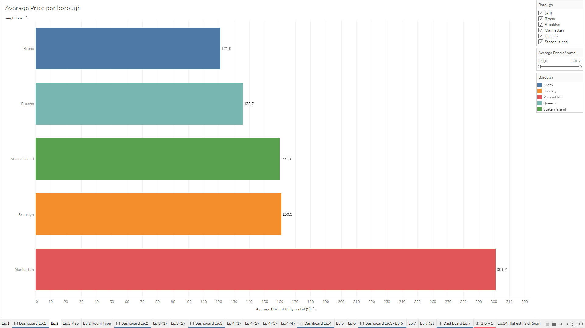
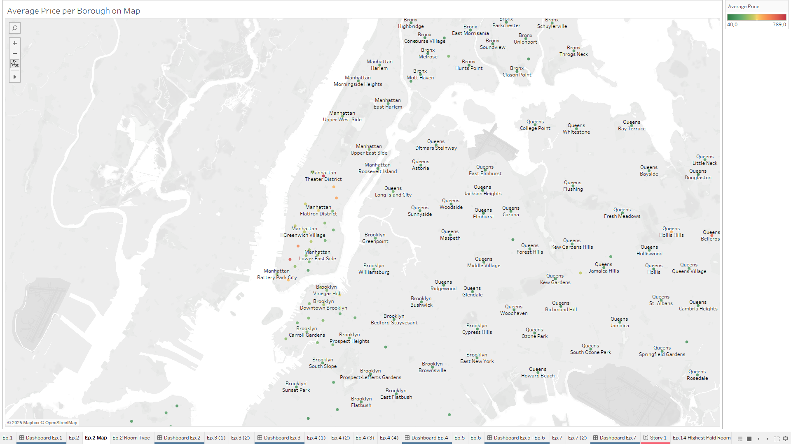
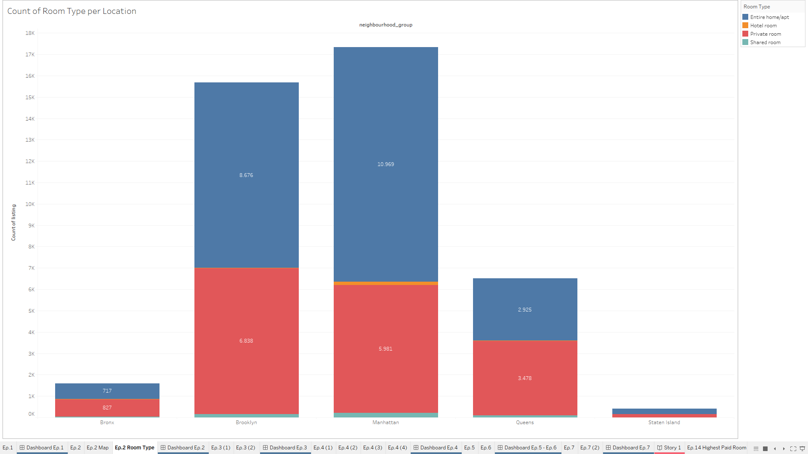
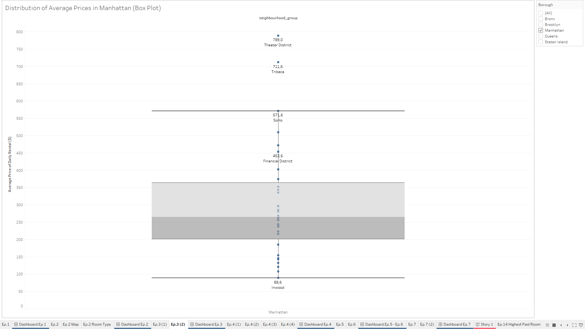
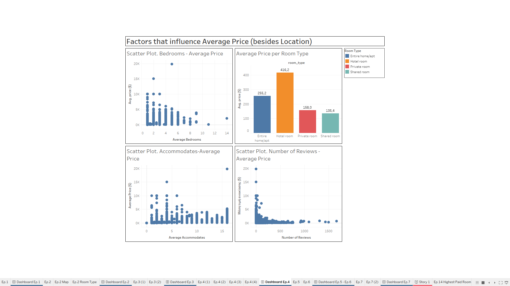
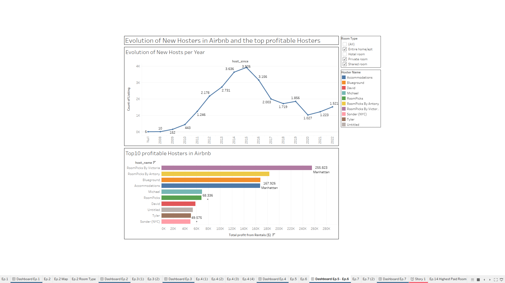
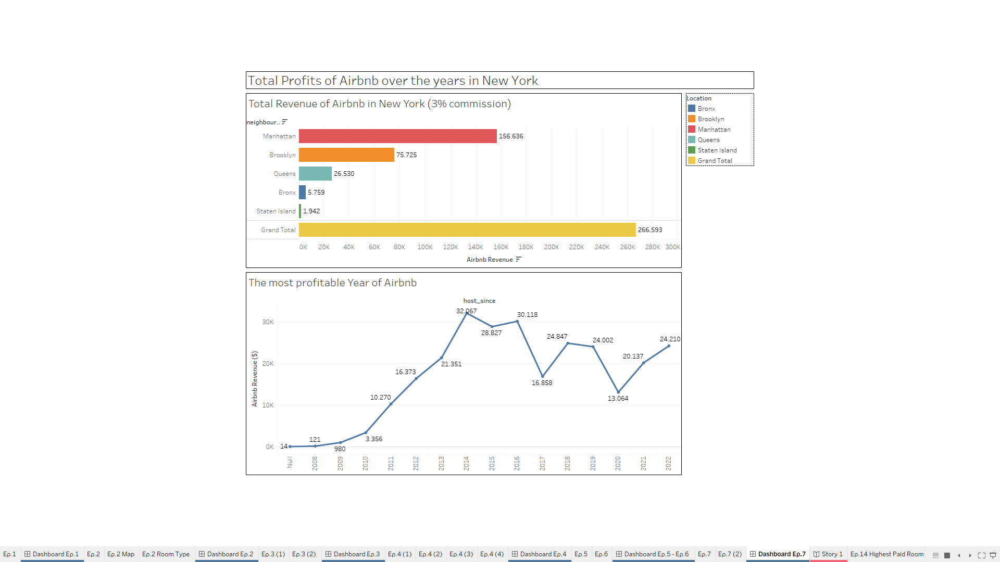

> 📊 Scroll down to explore dashboards
##  Project Overview
This project explores Airbnb listings data in New York City.
The goal was to answer analytical and business questions regarding pricing, availability, host performance and customer preferences.
The analysis was conducted in Tableau, combining interactive dashboards and storytelling
##  Tools
- Tableau Desktop
- Excel/CSV dataset
## Key Questions Answered
1. Which borough has the most rentals and what rental types dominates each area?
2. Which neighborhoods offer the most affordable rentals?
3. What factors (besides location) influence rental prices?
4. How have hosts evolved over time?
5. Who are the most profitable hosts and how much revenue does Airbnb generate?
*(+11 more questions detailed in the report)
##  Files in this Repository 
- 'Christos_Bouliaris_Assessment.twbx' -> Tableau Packaged Workbook (dashboards + data)
- 'screenshots' -> PNG images of dashboards
- 'data' -> Excel dataset of Airbnb listing
##  How to View
1. Open the file 'Christos_Bouliaris_Assessment.twbx'
2. Open it using Tableau Desktop
3. Explore the dashboards and visualizations interactively
##  Εxample Dashboards
### Average Daily Price per Borough

### Average Price in Map

### Room Types per Location

### Distribution of Average Price in Manhattan

### Factors that Influence Average Price

### Line Chart – Evolution of New Hosts in Airbnb

### Total Revenue of Airbnb over the years

## Data Source
- `data/Airbnb_listing.xlsx` → The dataset used for this analysis.
Source: Inside Airbnb (public dataset)

